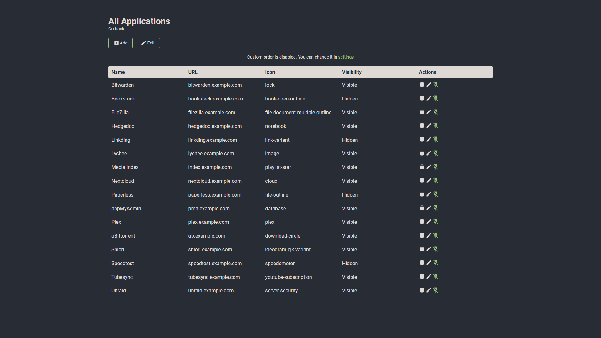
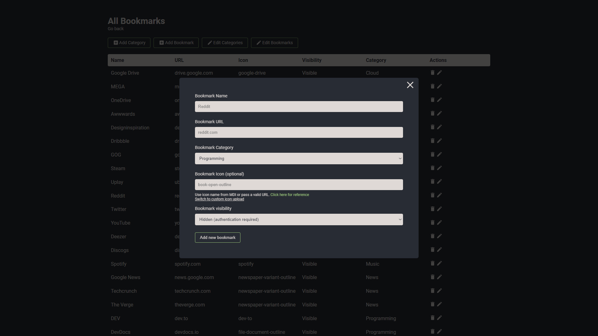
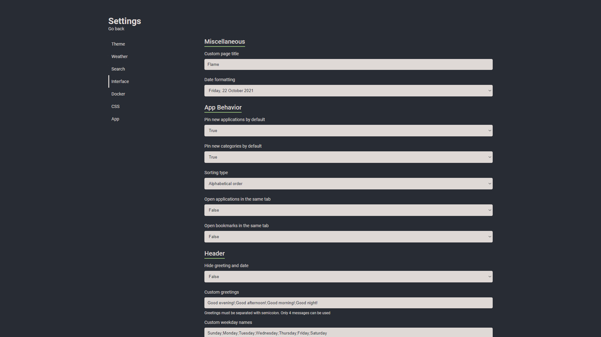

# Flame


## Description

Flame is self-hosted startpage for your server. Its design is inspired (heavily) by [SUI](https://github.com/jeroenpardon/sui). Flame is very easy to setup and use. With built-in editors, it allows you to setup your very own application hub in no time - no file editing necessary.

## Functionality
📝 Create, update, delete your applications and bookmarks directly from the app using built-in GUI editors

📌 Pin your favorite items to the homescreen for quick and easy access

🔍 Integrated search bar with local filtering, 11 web search providers and ability to add your own

🔑 Authentication system to protect your settings, apps and bookmarks

🔨 Dozens of option to customize Flame interface to your needs, including support for custom CSS and 15 built-in color themes
  
☀️ Weather widget with current temperature, cloud coverage and animated weather status

🐳 Docker integration to automatically pick and add apps based on their labels

## Installation

### With Docker (recommended)

[Docker Hub link](https://hub.docker.com/r/pawelmalak/flame)

```sh
docker pull pawelmalak/flame

# for ARM architecture (e.g. RaspberryPi)
docker pull pawelmalak/flame:multiarch

# installing specific version
docker pull pawelmalak/flame:2.0.0
```

#### Building images

```sh
# build image for amd64 only
docker build -t flame -f .docker/Dockerfile .

# build multiarch image for amd64, armv7 and arm64
# building failed multiple times with 2GB memory usage limit so you might want to increase it
docker buildx build \
  --platform linux/arm/v7,linux/arm64,linux/amd64 \
  -f .docker/Dockerfile.multiarch \
  -t flame:multiarch .
```

#### Deployment

```sh
# run container
docker run -p 5005:5005 -v /path/to/data:/app/data flame
```

#### Docker-Compose

```yaml
version: '2.1'
services:
  flame:
    image: pawelmalak/flame:latest
    container_name: flame
    volumes:
      - <host_dir>:/app/data
      - /var/run/docker.sock:/var/run/docker.sock # optional but required for Docker integration feature
    ports:
      - 5005:5005
    environment:
      - PASSWORD=flame_password
    restart: unless-stopped
```

#### Skaffold

```sh
# use skaffold
skaffold dev
```

### Without Docker

Follow instructions from wiki: [Installation without Docker](https://github.com/pawelmalak/flame/wiki/Installation-without-docker)

## Development

### Technology

- Backend
  - Node.js + Express
  - Sequelize ORM + SQLite
- Frontend
  - React
  - Redux
  - TypeScript
- Deployment
  - Docker
  - Kubernetes

### Creating dev environment

```sh
# clone repository
git clone https://github.com/pawelmalak/flame
cd flame

# run only once
npm run dev-init

# start backend and frontend development servers
npm run dev
```

## Screenshots








## Usage

### Authentication

Visit [project wiki](https://github.com/pawelmalak/flame/wiki/Authentication) to read more about authentication

### Search bar

#### Searching

To use search bar you need to type your search query with selected prefix. For example, to search for "what is docker" using google search you would type: `/g what is docker`.

> You can change where to open search results (same/new tab) in the settings

For list of supported search engines, shortcuts and more about searching functionality visit [project wiki](https://github.com/pawelmalak/flame/wiki/Search-bar).

### Setting up weather module

1. Obtain API Key from [Weather API](https://www.weatherapi.com/pricing.aspx).
   > Free plan allows for 1M calls per month. Flame is making less then 3K API calls per month.
2. Get lat/long for your location. You can get them from [latlong.net](https://www.latlong.net/convert-address-to-lat-long.html).
3. Enter and save data. Weather widget will now update and should be visible on Home page.

### Docker integration

In order to use the Docker integration, each container must have the following labels:

```yml
labels:
  - flame.type=application # "app" works too
  - flame.name=My container
  - flame.url=https://example.com
  - flame.icon=icon-name # optional, default is "docker"
# - flame.icon=custom to make changes in app. ie: custom icon upload
```

> "Use Docker API" option must be enabled for this to work. You can find it in Settings > Docker

You can also set up different apps in the same label adding `;` between each one.

```yml
labels:
  - flame.type=application
  - flame.name=First App;Second App
  - flame.url=https://example1.com;https://example2.com
  - flame.icon=icon-name1;icon-name2
```

If you want to use a remote docker host follow this instructions in the host:

- Open the file `/lib/systemd/system/docker.service`, search for `ExecStart` and edit the value

```text
ExecStart=/usr/bin/dockerd -H tcp://0.0.0.0:${PORT} -H unix:///var/run/docker.sock
```

>The above command will bind the docker engine server to the Unix socket as well as TCP port of your choice. “0.0.0.0” means docker-engine accepts connections from all IP addresses.

- Restart the daemon and Docker service

```shell
sudo systemctl daemon-reload
sudo service docker restart
```

- Test if it is working

```shell
curl http://${IP}:${PORT}/version
```

### Kubernetes integration

In order to use the Kubernetes integration, each ingress must have the following annotations:

```yml
metadata:
  annotations:
  - flame.pawelmalak/type=application # "app" works too
  - flame.pawelmalak/name=My container
  - flame.pawelmalak/url=https://example.com
  - flame.pawelmalak/icon=icon-name # optional, default is "kubernetes"
```

> "Use Kubernetes Ingress API" option must be enabled for this to work. You can find it in Settings > Docker

### Import HTML Bookmarks (Experimental)

- Requirements
  - python3
  - pip packages: Pillow, beautifulsoup4
- Backup your `db.sqlite` before running script!
- Known Issues:
  - generated icons are sometimes incorrect
  
```bash
pip3 install Pillow, beautifulsoup4

cd flame/.dev
python3 bookmarks_importer.py --bookmarks <path to bookmarks.html> --data <path to flame data folder>
```

### Custom CSS and themes

See project wiki for [Custom CSS](https://github.com/pawelmalak/flame/wiki/Custom-CSS) and [Custom theme with CSS](https://github.com/pawelmalak/flame/wiki/Custom-theme-with-CSS).
