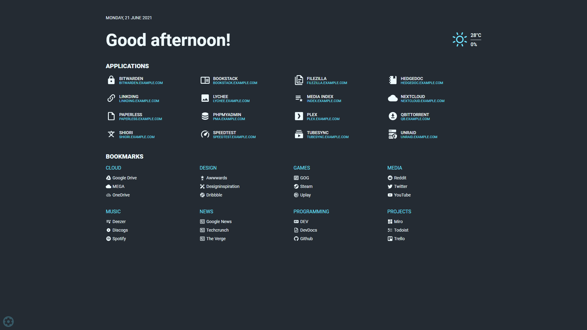
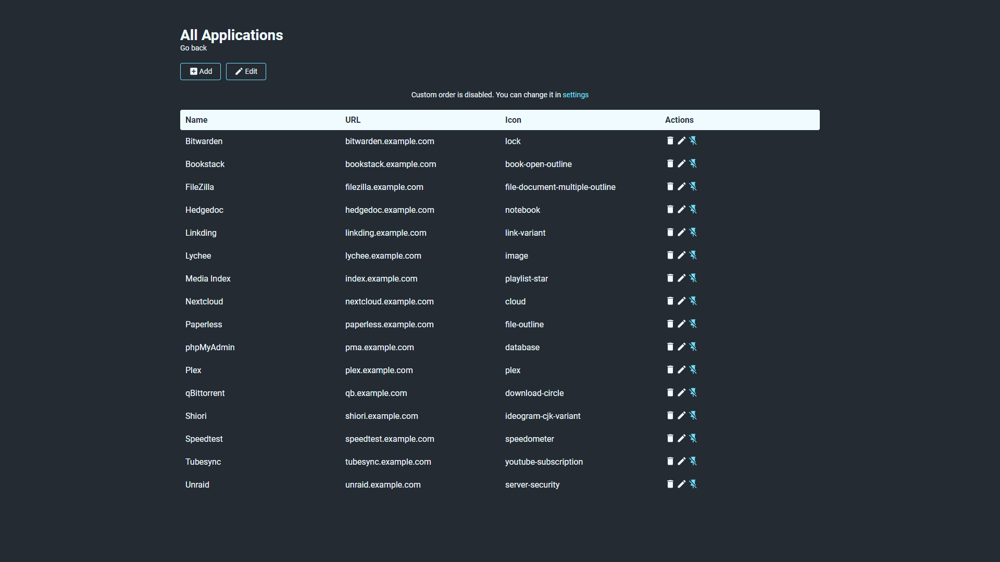
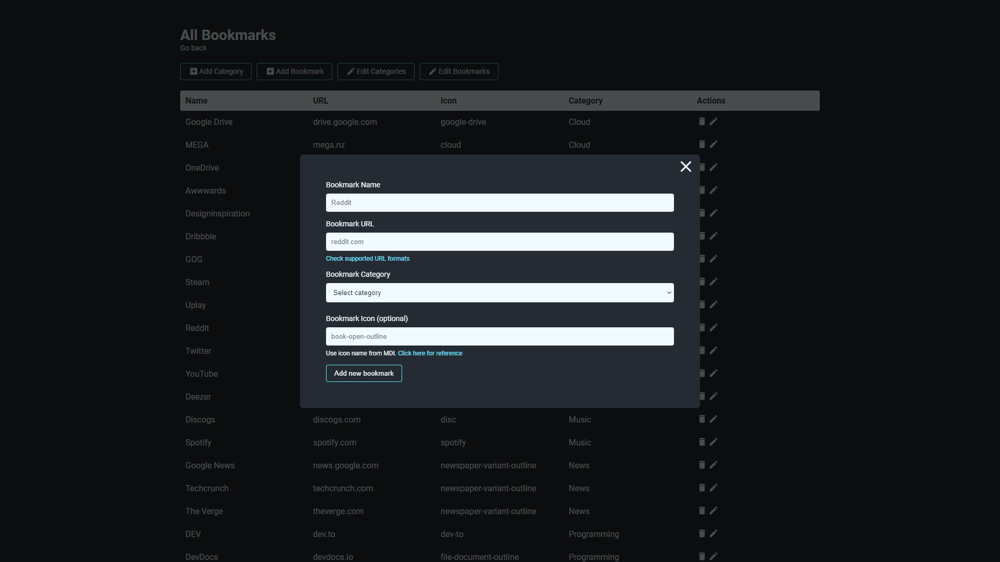

# Flame

[](https://shields.io/)
[](https://shields.io/)
[](https://shields.io/)
[](https://shields.io/)



## Description

Flame is self-hosted startpage for your server. Its design is inspired (heavily) by [SUI](https://github.com/jeroenpardon/sui). Flame is very easy to setup and use. With built-in editors it allows you to setup your very own appliaction hub in no time - no file editing necessary.

## Technology

- Backend
  - Node.js + Express
  - Sequelize ORM + SQLite
- Frontend
  - React
  - Redux
  - TypeScript
- Deployment
  - Docker

## Development

```sh
# clone repository
git clone https://github.com/pawelmalak/flame
cd flame

# run only once
npm run dev-init

# start backend and frontend development servers
npm run dev
```

## Installation

### With Docker (recommended)

[Docker Hub](https://hub.docker.com/r/pawelmalak/flame)

#### Building images

```sh
# build image for amd64 only
docker build -t flame .

# build multiarch image for amd64, armv7 and arm64
# building failed multiple times with 2GB memory usage limit so you might want to increase it
docker buildx build \
  --platform linux/arm/v7,linux/arm64,linux/amd64 \
  -f Dockerfile.multiarch \
  -t flame:multiarch .
```

#### Deployment

```sh
# run container
docker run -p 5005:5005 -v /path/to/data:/app/data flame
```

#### Docker-Compose

```yaml
version: '2.1'
services:
  flame:
    image: pawelmalak/flame:latest
    container_name: flame
    volumes:
      - <host_dir>:/app/data
      - /var/run/docker.sock:/var/sock/docker.sock # optional but required for Docker integration feature
    ports:
      - 5005:5005
    restart: unless-stopped
```

### Without Docker

Follow instructions from wiki: [Installation without Docker](https://github.com/pawelmalak/flame/wiki/Installation-without-docker)

## Functionality

- Applications
  - Create, update, delete and organize applications using GUI
  - Pin your favourite apps to homescreen



- Bookmarks
  - Create, update, delete and organize bookmarks and categories using GUI
  - Pin your favourite categories to homescreen



- Weather

  - Get current temperature, cloud coverage and weather status with animated icons

- Themes
  - Customize your page by choosing from 12 color themes


## Usage

### Search bar

#### Searching

To use search bar you need to type your search query with selected prefix. For example, to search for "what is docker" using google search you would type: `/g what is docker`.

> You can change where to open search results (same/new tab) in the settings

#### Supported search engines

| Name       | Prefix | Search URL                          |
| ---------- | ------ | ----------------------------------- |
| Disroot    | /ds    | http://search.disroot.org/search?q= |
| DuckDuckGo | /d     | https://duckduckgo.com/?q=          |
| Google     | /g     | https://www.google.com/search?q=    |

#### Supported services

| Name               | Prefix | Search URL                                    |
| ------------------ | ------ | --------------------------------------------- |
| IMDb               | /im    | https://www.imdb.com/find?q=                  |
| Reddit             | /r     | https://www.reddit.com/search?q=              |
| Spotify            | /sp    | https://open.spotify.com/search/              |
| The Movie Database | /mv    | https://www.themoviedb.org/search?query=      |
| Youtube            | /yt    | https://www.youtube.com/results?search_query= |

### Setting up weather module

1. Obtain API Key from [Weather API](https://www.weatherapi.com/pricing.aspx).
   > Free plan allows for 1M calls per month. Flame is making less then 3K API calls per month.
2. Get lat/long for your location. You can get them from [latlong.net](https://www.latlong.net/convert-address-to-lat-long.html).
3. Enter and save data. Weather widget will now update and should be visible on Home page.

### Supported URL formats for applications and bookmarks

#### Rules

- URL starts with `http://`
  - Format: `http://www.domain.com`, `http://domain.com`
  - Redirect: `{dest}`
- URL starts with `https://`
  - Format: `https://www.domain.com`, `https://domain.com`
  - Redirect: `https://{dest}`
- URL without protocol
  - Format: `www.domain.com`, `domain.com`, `sub.domain.com`, `local`, `ip`, `ip:port`
  - Redirect: `http://{dest}`

### Docker integration

In order to use the Docker integration, each container must have the following labels:

```yml
labels:
  - flame.type=application # "app" works too
  - flame.name=My container
  - flame.url=https://example.com
  - flame.icon=icon-name # Optional, default is "docker"
```

And you must have activated the Docker sync option in the settings panel.

### Custom CSS

> This is an experimental feature. Its behaviour might change in the future.
>
> Follow instructions from wiki: [Custom CSS](https://github.com/pawelmalak/flame/wiki/Custom-CSS)

## Support

If you want to support development of Flame and my upcoming self-hosted and open source projects you can use the following link:

[](https://www.paypal.com/paypalme/pawelmalak)
