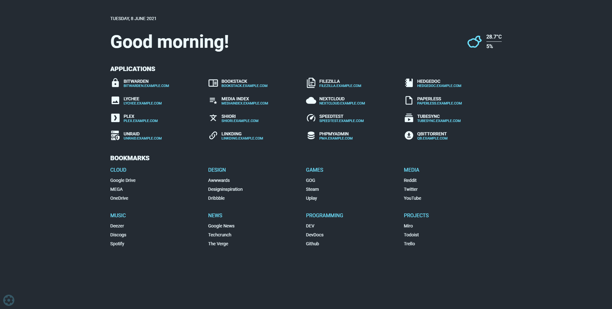
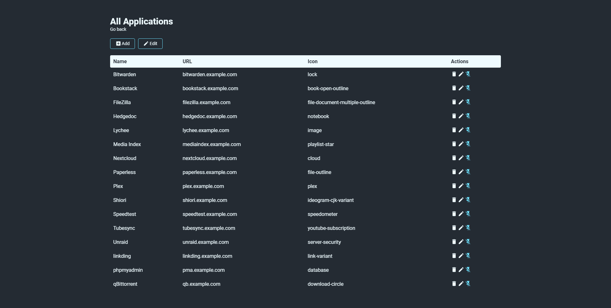
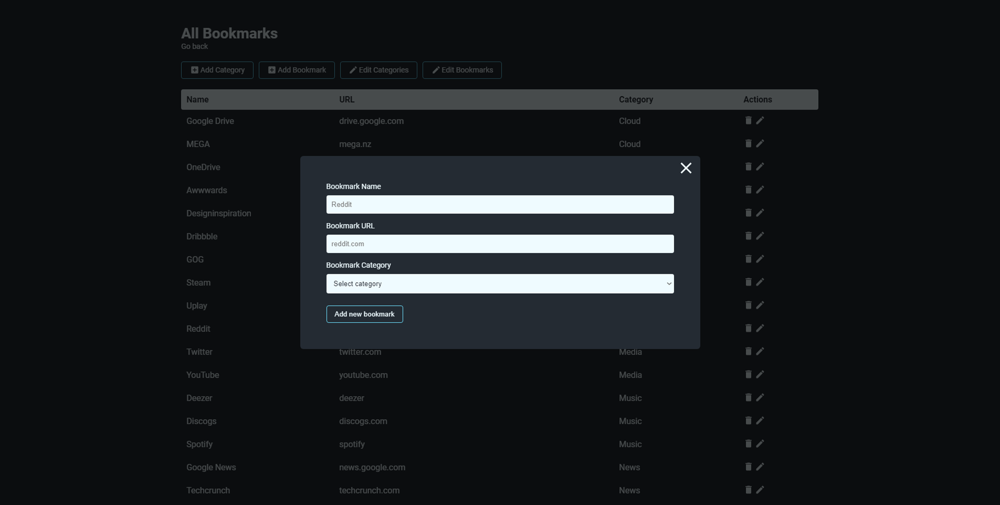
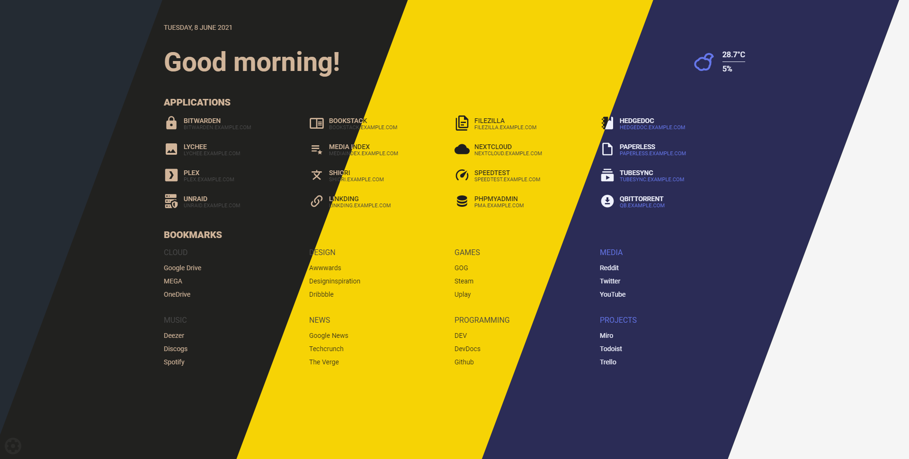

# Flame

[](https://shields.io/)
[](https://shields.io/)
[](https://shields.io/)



## Description
Flame is self-hosted startpage for your server. It's inspired (heavily) by [SUI](https://github.com/jeroenpardon/sui)

## Technology
- Backend
  - Node.js + Express
  - Sequelize ORM + SQLite
- Frontend
  - React 
  - Redux
  - TypeScript
- Deployment
  - Docker

## Development
```sh
git clone https://github.com/pawelmalak/flame
cd flame

# run only once
npm run dev-init

# start backend and frontend development servers
npm run dev
```

## Deployment with Docker
```sh
# build image
docker build -t flame .

# run container
docker run -p 5005:5005 -v <host_dir>:/app/data flame
```

## Functionality
- Applications
  - Create, update and delete applications using GUI
  - Pin your favourite apps to homescreen



- Bookmarks
  - Create, update and delete bookmarks and categories using GUI
  - Pin your favourite categories to homescreen



- Weather
  - Get current temperature, cloud coverage and weather status with animated icons
- Themes
  - Customize your page by choosing from 12 color themes 

